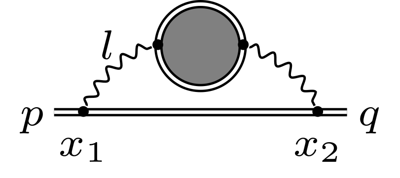

# SFQED-Loops
This is a collection of Mathematica scripts developed for calculating loop processes in Strong-Field QED specifically in a constant crossed external electromagnetic field.

## What is it about?

This repository contains some specific tools for theoretical studies of interacting electrons, positrons and photons in a very strong (constant crossed) external electromagnetic field, namely, Strong-Field Quantum Electrodynamics. This project is devoted particularly to calculation of some loop corrections to SFQED processes like photon polarization and electron mass operators at one- and higher-loop levels.

If you are new to the field, it is recommended to have a look at some introductory texts and reviews
- N. Narozhny, Intense Field Quantum Electrodynamics, Laser-Plasma Interactions, 315-342 (2009)
https://doi.org/10.1201/9781584887799-20
- K. Felix Mackenroth, Quantum Radiation in Ultra-Intense Laser Pulses, Springer Theses (2014)
https://doi.org/10.11588/heidok.00014253
- V. I. Ritus, Quantum effects of the interaction of elementary particles with an intense electromagnetic field, J. Russ. Laser Res. 6, 497 (1985)
https://doi.org/10.1007/BF01120220
- A. Di Piazza, C. Müller, K. Z. Hatsagortsyan, and C. H. Keitel, Extremely high-intensity laser
interactions with fundamental quantum systems, Rev. Mod. Phys. 84, 1177 (2012)
https://doi.org/10.1103/RevModPhys.84.1177
- T. Blackburn, Radiation reaction in electron–beam interactions with high-intensity lasers,
Reviews of Modern Plasma Physics 4, 1 (2020)
https://doi.org/10.1007/s41614-020-0042-0
- A. Gonoskov, T. Blackburn, M. Marklund, and S. Bulanov, Charged particle motion and
radiation in strong electromagnetic fields, arXiv preprint arXiv:2107.02161 (2021)
https://arxiv.org/abs/2107.02161

This list is totally not comprehensive, but these references may serve as a starting point.

## Motivation
SFQED calculations are known to be lengthy and both hard to perform by hands and to represent in print. As an example, one may spend months struggling to recompute the 1-loop results from the paper [V. I. Ritus, Radiative corrections in quantum electrodynamics with intense field and their
analytical properties, Ann. Phys. 69, 555 (1972)]. Computer algebra can be a lifesaver, allowing both to elaborate results efficiently and present full-length calculations. 

The aims of the SFQED-Loops script collection are
1. presentation a detailed calculation of a number of loop diagrams;
2. development of an approach that will allow to proceed further in studies of SFQED higher-order loop or other types of processes;
3. to accompany the following papers, containing the results and their analysis: 
	- A. A. Mironov, A. M. Fedotov https://arxiv.org/abs/2109.00634 (2021)
	- A. A. Mironov, S. Meuren, and A. M. Fedotov, PRD 102, 053005 (2020),
      https://doi.org/10.1103/PhysRevD.102.053005 

## Contents
Each script (except _definitions.nb_) presents a full-length calculation of a QED diagram in a strong constant crossed field (CCF). Almost every file contains detailed comments, an explanation of prerequisites and the formulation of the main result at the end of the file.

For more details about the general approach, notations etc, please, see our papers 
1. https://arxiv.org/abs/2109.00634
2. https://doi.org/10.1103/PhysRevD.102.053005 (https://arxiv.org/abs/2003.06909)

### The list of diagrams

#### The tree-level electron propagator in a CCF in the proper time representation

Filename: _tree-level e propagator.nb_

The script shows how to transform the electron propagator in the Ritus E-p representation into the proper time representation (in accordance with J. Schwinger's result)

#### The bubble-chain photon propagator in a CCF in the proper time representation

Filename: _bubble-chain photon propagator.nb_

Transformation of the bubble-chain photon propagator in the momentum representation (obtained by N.B. Narozhny) into the proper time representation

#### The exact (dressed by radiative corrections) electron propagator in a CCF in the proper time representation

Filename: _exact e propagator.nb_

Transformation of the exact electron propagator into the proper time representation. The starting point is the dressed electron propagator in the Ritus E-p representation accounting for the full set of radiative corrections. It is spanned by the set of gamma-matrix operators specific to the CCF.

#### The bubble-chain mass operator

Filename: _bubble-chain mass operator.nb_

The script shows the full calculation of the resummed electron mass operator in the bubble-chain approximation. The starting point is the 1st-order electron propagator (see 'LO e propagator (proper time).nb') and the bubble-chain photon propagator (see 'bubble-chain photon propagator (proper time).nb') in the proper time representation. 

## Prerequisites and known issues

The SFQED-Loops scripts are developed and tested in Wolfram Mathematica 11.2 and rely on the package [FeynCalc](https://feyncalc.github.io/) 9.2.0.

There are known issues (to be fixed) with later versions of [FeynCalc](https://feyncalc.github.io/), as there are some slight changes in FeynCalc syntax starting from 9.3 (e.g. for the Levi-Civita tensor in D dimensions, see '''Eps''' in [FeynCalc reference](https://feyncalc.github.io/reference))

A PDF version of each script is included for reference, so that you can study them without running in Mathematica.

## Usage

Each script depends on _definitions.nb_. It should be placed in the same local directory as the script of your interest. Every other script is independent and can be loaded separately. To perform a calculation, load the script and execute it. 

_definitions.nb_ contains general definitions of the functions and symbolic substitutions in use. It is recommended to study this script first if you are interested in technical details.

## Contribute

If you would like to contribute, find an issue or have any questions, please, feel free to contact me by mail:
Arseny Mironov mironov.hep@gmail.com

Usage of these scripts in your studies is welcomed. If they appear to be useful in your research, please, consider citing our papers:
	- https://doi.org/10.1103/PhysRevD.102.053005 
    - https://arxiv.org/abs/2109.00634

## Credits
Arseny Mironov - main developer (https://scholar.google.ru/citations?user=GQwNEuwAAAAJ)

Alexander Fedotov - scientific guidance (https://scholar.google.ru/citations?user=LLaBL-EAAAAJ)

## License
[GPLv3](https://www.gnu.org/licenses/gpl-3.0.en.html)
